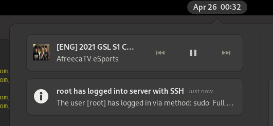

# Townwatch

Townwatch a simple alerting utility for servers. It is named for the Age of Empires 2 [upgrade of the same name][townwatchaoe].
Townwatch which is an upgrade seldomly used in competitive play as there are usually better options; e.g. Loom, Wheelbarrow.

Like it's namesake there is probably a better server monitoring tool than townwatch. This tool is intended for simple
monitoring. It functions by using regular expressions and a set of notification methods. Good uses are:

* SSH Authentication alerting
* HTTP Administration authorization logging
* Fail2ban action logging
* Backup completion log message alerting

As those examples demonstrate you couldn't (easily) use townwatch to alert on things like, limited disk space. (You could
but this would need to come from a log, somewhere). Instead for such examples try something like [prometheus][prometheus].

## Usage

``` text
A log watching tool which alerts

Usage:
  townwatch [command]

Available Commands:
  check       Check config file
  help        Help about any command
  patrol      Start log watch server
  version     print version

Flags:
      --config string      config file (default is /etc/townwatch/townwatch.yaml)
  -h, --help               help for townwatch
      --log-level string   Log level (debug, info, warn, error, fatal, panic (default "warning")

Use "townwatch [command] --help" for more information about a command.
```

See `examples/` for a sample config file.

### Specific

``` bash
$ townwatch patrol --config smtp-ssh-example.yaml
```

Might result in the following execution:

``` text
$ ./townwatch patrol --config smtp-ssh-example.yaml
INFO[0000] And now my watch begins.
INFO[0000] Sending startup notification.
INFO[0000] Sent mail to [user@example.com].
INFO[0000] Starting watcher: SSHD Login
INFO[0000] Seeked /tmp/auth.log - &{Offset:0 Whence:2}
INFO[0006] Line was captured!           line="Apr 27 11:01:19 edoras sudo: pam_unix(sudo:session): session opened for user root by theoden(uid=0)"
INFO[0006] Sent mail to [user@example.com].
```

Configurations can be validated with example regex at `patrol` startup but also with the `check` command:

```
townwatch check --no-notify  --config smtp-ssh-example.yaml
INFO[0000] Checking configuration.
WARN[0000] Test notification was skipped.
INFO[0000] Watcher SSHD Login has passed inspection.
```

## Receiver types



_Example of Townwatch using gotify; alerting to my gnome desktop that root logged into a remote server._

The types of alert receivers:

* SMTP
* Gotify
* Pushbullet
* Stdout

### SMTP

Configure your alerts to be delivered by email. SMTP config is very provider specific. For some providers such as gmail,
you might expect the sender to be the same as the account email. In my case, my root account has an email alias. So I use
my main login, and a different sender.

``` yaml
receiver:
  type: smtp
  sender_email: townwatch@example.com
  recipient_email: theAdmin@example.com
  account_email: accountHolder@example.com
  password: akj32lkc02j
  smtp_server: smtp.example.com
  smtp_port: 587
```

### Gotify

[Gotify][gotify] is a really cool self hosted notification server. It supports markdown and has clients for; Android, iOS, Browser, CLI. It's great.

Because it's self hosted you might have some extra config. Tokens are created via the API/webUI. Config is user specific. You should try to use Let's Encrypt if you can.

Please do:

``` yaml
receiver:
  type: gotify
  token: AACJfcajlej42n-Z # this is fake ofc.
  server: gotify.example.com
```

For SSL; `ssl: true` is the default, so optional, `port: 443` is default, so optional.

For dev:

``` yaml
receiver:
  type: gotify
  token: AACJfcajlej42n-Z # this is fake ofc...
  server: localhost
  port: 80
  ssl: false
```

### PushBullet

[PushBullet][pb] is a free* notification platform for Android/iOS desktop.

``` yaml
receiver:
  type: pushbullet
  access_token: o.CLERAFJ2k2jclakdFakdfj2laFDAjEaj # this is fake ofc...
```

### Stdout

Simply print the regex captures to there terminal. Useful for dev/debugging:

```
INFO[0012] Notify!                                       message="The user [root] has logged in via method: sudo\nFull line: sudo: pam_unix(sudo:session): session opened for user root\n" title="root has logged into server with SSH"
```

Defined simply:

``` yaml
receiver:
  type: stdout
```

## Watch configs

The chief operation for townwatch; where to look, what to look for, how to structure the alert notification.

```
watchers:
  - name: SSHD Login
    regex: '(?P<Line>(?P<Method>sshd|su(?:do)?)(?:\[\d+\])?: pam_unix\(\w+:session\): session opened for user (?P<User>\w+))'
    path: /var/log/auth.log
    examples:
      - 'Apr 27 11:01:19 edoras sudo: pam_unix(sudo:session): session opened for user root by theoden(uid=0)'
    title: '{{.User}} has logged into server with SSH'
    message: |
      The user [{{.User}}] has logged in via method: {{.Method}}
      Full log line: {{.Line}}
```

Watchers are a regular expression you might want to use on a particular file. In the example above, We look for sshd or su user escalations.

Regex follows standard formats: `(?P<Foo>)` is used to specify named capture groups. These capture groups can be used in go templates. Townwatch
will check that if a title or message uses a template field, it is part of the named regex captures, warning if it isn't.

The example strings: `watchers[x].examples[]` is optional. This can be used to validate the regex with `townwatch check`, and is a good idea.

Go templating in title and message support all go template actions. For example consider changes to the title if the auth user is root:

```
title: '{{ if (eq .User "root")}}[Urgent!] {{end}}{{.User}} has logged into server with SSH'
```

## Developing

Typically I have done the following:

Modify config to be stdout and file is in `/tmp`

_Term1_
```
$ go build; ./townwatch patrol --config ./examples/townwatch.yaml
```

_Term2_
```
$ echo 'Apr 27 11:01:19 edoras sudo: pam_unix(sudo:session): session opened for user root by theoden(uid=0)' >> /tmp/auth.log
```
Repeat.


## TODO:

* Bundle notifications, right now just one receiver allowed.
* Unit tests (`./townwatch check`) works decently ok for now.
* Multiple regex per file, or a singleton tail object for all similar file watchers.
* Tail support for the linux journal `journalctl -fu foo.service`
  * Same but for `docker logs`
  * Guessing, create logger interface; file, journal, docker.

[townwatchaoe]: https://ageofempires.fandom.com/wiki/Town_Watch_(Age_of_Empires_II)
[prometheus]: https://prometheus.io/
[pb]: https://www.pushbullet.com/
[gotify]: https://gotify.net/
